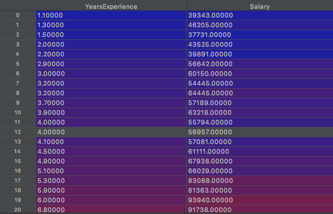
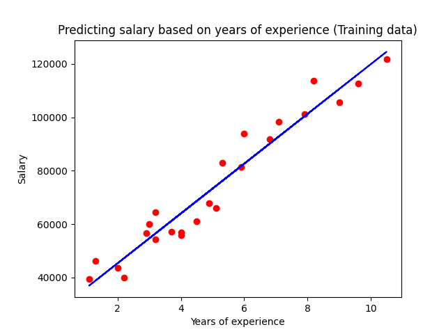
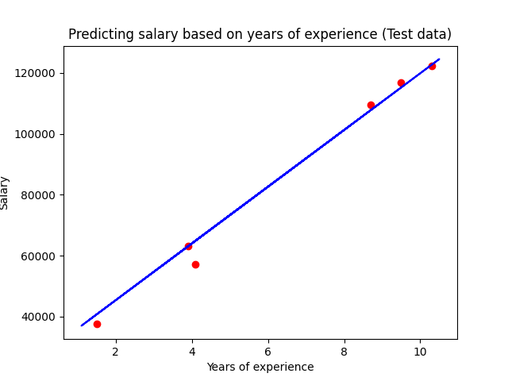

# SalaryPrediction-SimpleLinearRegression
Simple linear regression model for salary prediction
# Importing libraries
```python
import pandas as pd
import numpy as np
import matplotlib.pyplot as plt
import os

# Importing the dataset
dataset = pd.read_csv('Salary_Data.csv')
X = dataset.iloc[:,[0]].values
y = dataset.iloc[:,[1]].values
```

```python
# Splitting the data into training and test set
from sklearn.model_selection import train_test_split
X_training_data, X_test_data, y_training_data, y_test_data = train_test_split(X, y, test_size=0.2, random_state = 0)

# Fitting the simple linear regression model on the training data
from sklearn.linear_model import LinearRegression
regressor = LinearRegression()
regressor.fit(X_training_data, y_training_data)
y_pred = regressor.predict(X_test_data)

# Visualising results of the training data
plt.scatter (X_training_data, y_training_data, color = 'red')
plt.plot (X_training_data, regressor.predict(X_training_data), color = 'blue')
plt.title ('Predicting salary based on years of experience (Training data)')
plt.xlabel ('Years of experience')
plt.ylabel ('Salary')
plt.show()
```


```python 
# Visualising results of the test data
plt.scatter (X_test_data, y_test_data, color = 'red')
plt.plot (X_training_data, regressor.predict(X_training_data), color = 'blue')
plt.title ('Predicting salary based on years of experience (Test data)')
plt.xlabel ('Years of experience')
plt.ylabel ('Salary')
plt.show()
```



